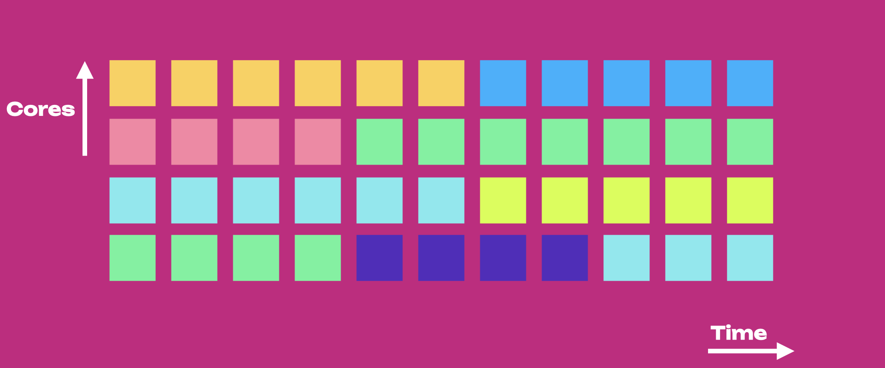
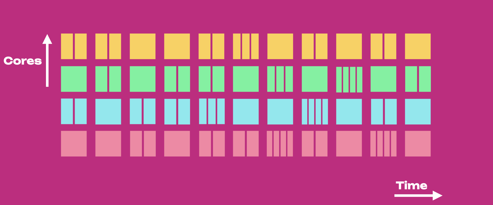
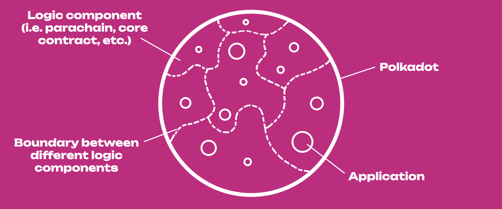

:::info

The material on this page is based on
[Gavin Wood's talk at Polkadot Decoded 2023](https://www.youtube.com/watch?v=GIB1WeVuJD0).

:::

Understanding what [Polkadot 1.0](./polkadot-v1.md) is about and the philosophy behind it will help
us to envision the future direction of the Polkadot ecosystem toward abstraction and generalization.

## Polkadot as a Computational Resource

Polkadot has been abstracted and generalized beyond what was originally proposed and envisioned in
the [whitepaper](https://polkadot.network/whitepaper/). Polkadot is:

- About [**Blockspace**](./polkadot-v1.md#polkadots-blockspace) (the underlying resources that
  chains need), not chains.
- **A platform to build applications** rather than chains and for people to use those applications.
  Fundamentally, Polkadot is not a platform to host chains, and so far, chains happened to be one
  way to build applications and grow Polkadot's utility.
- **A provider of resilient general-purpose continuation computation**, where the term
  _continuation_ refers to a broad long-running task that can do something, pause, and do some more
  (or something else) later on.
- **A multicore computer** where chains that continuously operate in parallel on different cores are
  called parachains. Currently, one core is reserved for one chain through
  [slot auction mechanism](../learn/learn-auction.md), although one core can be reserved on-demand
  to multiple chains at different periods (see [parathreads](../learn/learn-parathreads.md)). At the
  time of writing (mid 2023), on Polkadot, there are around 50 cores independently operating in
  parallel. Prediction models show that cores can increase to 500-1000 in the following few years.

As a computational resource, Polkadot can be described as a traditional CPU, and at the time of
writing it has the following benchmarking features:

- Bandwidth: ~1MB/s
- Compute: Geekbench 5 SC score ~380
- Latency: 6s (time between two consecutive tasks)

These ratings will likely increase over time.

## Contracts on Cores

If we follow this line of Polkadot being a global ubiquitous supercomputer, cores can be used to run
applications that can be deployed using:

- parachains and
- smart contracts, avoiding the need for custom chain infrastructure. This would be effective for
  contracts with constrained state and I/O (i.e., 2.5 MB) and heavy computing requirements. Such
  contracts will also benefit from a secure and broad message-passing environment.

From now _application_ will be used as a general term to describe anything that can use a Polkadot
core to access secure, decentralized, and ubiquitous computation.

## From Slot Auctions to Coretime Marketplace

The end product of blockchains is [**Blockspace**](./polkadot-v1.md#polkadots-blockspace).
Applications need to access Polkadot's blockspace, and the entry points to blockspace are the cores.
Thus, applications will need to reserve some time on cores or **Coretime** to gain the right to
access Polkadot's secure blockspace and interoperability for a definite period.

Cores are agile and general: they can change what job they run as easily as a modern CPU. It follows
that the procurement of those cores must be agile as well. The current slot auction mechanism is not
agile, creates high entry barriers, and is designed for long-running single applications (i.e. the
original Polkadot vision proposed in the whitepaper).

We depart from the classic lease auctions and propose an agile marketplace for Coretime where two
Polkadot-native sale options of Coretime are possible: **bulk** and **instantaneous**. This setup
maximizes the agility of Polkadot and lets the market figure out the best solution needed for the
applications to be successful.

### Bulk Coretime Rental

Bulk Coretime rental (primary market) is a monthly sale of 4 weeks of Coretime at a fixed price with
a target of, e.g., 75% of the available cores. The price will change depending on the deviation from
the target value, and unrented cores go to the instantaneous market. Special considerations might be
necessary for pre-existing applications.

Bulk Coretime does not need to be directly deployed because it is an asset, more precisely, a
non-fungible asset (unless it is for the same period). Coretime tokens are sold in a 4-week period
and they can be split into multiple NFTs of smaller periods. Coretime NFTs are sold and assigned by
a broker system parachain to the applications now owning the NFTs, which must be consumed to
allocate computation on a Polkadot core. The broker parachain records the price and the assignment,
and the Coretime can always be purchased the following month for the same assignment (i.e., same
application) with a capped price change. This rent control allows long-running applications to have
certainty and predictability about Coretime costs (not possible with lease auctions). The process of
assigning Coretime is irreversible.

In general, bulk Coretime NFTs can be:

- sold to one application (similar to the lease auctions in Polkadot 1.0, with the difference that
  Coretime in Polkadot 1.0 is not sold, but applications need to lock their DOT tokens)
- sold to several applications taking turns on a core
- placed on the instantaneous market
- exposed and sold by a broker system parachains via [XCM](./learn-xcm-index) NFT interface to
  Polkadot-powered applications that want to allow for these NFTs to be exchanged and traded on
  their market.

Bulk Coretime pricing will be initialized through Polkadot OpenGov and will likely start low to
minimize the entry barrier. Floor price, rent control, and right-of-first-refusal will give
long-term guarantees on the price paid and core availability.

### Instantaneous Coretime Rental

Instantaneous Coretime rental is the ongoing sale of Coretime for immediate use at a spot price
where an AMM regulates the price targeting 100% usage. Bulk Coretime can be placed in this market.

Instantaneous Coretime is purchased by applications through collators to boost throughput and/or
reduce latency with extra cores, and power more exotic [core contracts](#contracts-on-cores).

[Cumulus](../build/build-parachains.md#cumulus) will make sure that Coretime sales are adequately
utilized and optimized automatically.

### Coretime Revenues

Revenues from Coretime sales can be burnt, used to fund the Treasury, split between Coretime
providers (i.e., validators), or used for a mix of those options. The topic is currently under
discussion. For more information, see [RFC-0010](https://github.com/polkadot-fellows/RFCs/pull/10)
and [RFC-0015](https://github.com/polkadot-fellows/RFCs/pull/17/files).

## Core Usage in Polkadot 1.0

In Polkadot 1.0, applications produced blocks at a fixed rate of 12 seconds, whether needed or not.
This led to inefficient energy allocation and economic incentives for producing full blocks under
heavy traffic and empty blocks under light traffic.

The figure below shows the core usage for Polkadot 1.0, where the horizontal axis is time, and each
row represents a core. Different colors show five parachains, each using one core (i.e., one
parachain, one core formula).

Core affinity (i.e., which application operates on which core) is unimportant (see below). Cores do
not have any greater friendliness to one application than another.

Ideally, blocks are produced when needed, and the system targets full block capacity lowering the
probability of building blocks half full or, worse, empty.

We mentioned how the instantaneous Coretime rental targets 100% usage, and how bulk Coretime is sold
monthly, maximizing agility and letting the market figure out the best solution for applications.
The new vision of Polkadot will make the ecosystem even more agile and allow applications to tweak
how often they produce blocks based on their needs.

## Agile Coretime Allocation

### Split Coretime

Owners of Cortime can split or trade it. An application A1 can run on core C1 for a finite period
and then another application A2 can run on that core, or application A1 can continue running on
another core C2. Some applications might stop running for some time and resume later on.

### Strided Coretime

Ranges can be strided (i.e., applications can take turns on a core) to share costs or decrease block
production rate, for example.

### Combined Coretime

An application's task can be assigned to multiple cores simultaneously. Some applications can have a
permanent core assignment and an intermittent one, for example, in a period of high demand.

Coretime on additional cores can be bought on the instantaneous market to send multiple blocks to
multiple cores at the same time slot to reduce latency.

## Agile Core Usage

### Compressed Cores

The same core can secure multiple blocks of the same application simultaneously. Combining multiple
application blocks in the same relay chain core will reduce latency at the expense of increased
bandwidth for the fixed price of opening and closing a block.

### Shared Cores

Sharing cores with other applications to share costs but with no reduction in latency. Note that
this is different from the [split coretime](#split-coretime) where one core is used by multiple
application at different times to share costs at the expense of higher latency.

## Agile Ubiquitous Computer

All the above options of agile [Coretime allocation](#agile-coretime-allocation) and
[core usage](#agile-core-usage) can be composable and enable the creation of a highly agile
ubiquitous computing system.

Thus, this new vision is focused on Polkadot’s resource, which is secure, flexible and available
blockspace that can be accessed by reserving some time on a core. Agility in allocation of Coretime
and use of cores allow for maximized network efficiency.

## From Chain- to Application-centricity

Polkadot 1.0 was a chain-centric paradigm consisting of isolated chains able to exchange messages.
This was not fundamentally different from having completely different chains connected to bridges,
with the only difference of having the relay-chain securing the network, providing message-passing
capability, and doing some extra tasks such as [crowdloans](../learn/learn-crowdloans.md),
[auctions](../learn/learn-auction.md), [staking](../learn/learn-staking.md),
[accounts](./learn-accounts-index), [balances](../learn/learn-balance-transfers.md), and
[governance](../learn/learn-polkadot-opengov.md). Having a chain-centric system will ultimately end
in chain-centric application and UX.

The true value of Polkadot is about leveraging the unique value proposition offered by different
chains and using those chains’ collaborative potential to build inter-chain applications to solve
real-world problems. Those applications will thus need to span across chains and have a seamless UX.
Users will not need to understand how messages are delivered.

Increasingly fewer tasks will be handled by the relay-chain that will focus efforts only on primary
tasks: securing the network and providing secure message-passing capability.
[System parachains](../learn/learn-system-chains.md) will be used to take over secondary relay-chain
tasks such as staking, governance, etc.

### Agile Polkadot Representation

Polkadot 1.0 was represented with the
[relay-chain surrounded by parachains](./polkadot-v1.md#polkadots-representation). Following the new
application-centric vision, Polkadot can be better represented using the figure below.

Polkadot should be an integrated system (big circle), a single computer on which many applications
run (dots). There are boundaries between business logic components of Polkadot (dashed lines). Those
boundaries can enclose parachains or core contracts. Applications should be able to communicate with
each other within and across those boundaries. Last but not least, similar to a laptop, how Polkadot
works must not be necessary for the users who need it to use applications.

### XCM and Accords

[XCM](../learn/learn-xcm-transport.md) is a format, a language of intention abstract over
functionality common within chains. It creates an expressive language of what you intend to do or
want to happen. There are no guarantees that chains faithfully interpret XCM messages; thus, XCM is
not ideal if we are in a trustless environment.

[XCMP](../learn/learn-xcm.md) is the transport layer for delivering XCM messages. It gives the
transportation method and a secure route but not a framework for binding agreements.

An **Accord** is an _opt-in_ treaty across many chains, where treaty logic cannot be changed or
undermined by one or more of those chains, and Polkadot guarantees faithful execution of this logic.
Accords will be specific to a particular function, and any chain that enters the accord will be held
to it and will service that particular function. To lower the entry barrier, accords can be proposed
permissionlessly, but because they are opt-in, the accord proposal will take effect until chains
agree and sign up. Taking the [previous representation of Polkadot](#agile-polkadot-representation),
if we look at Polkadot no more from the top but from the side, accords come off and provide a
separate mechanism that overrules the local chain sovereignty, this is the **accord space**.

The above figure shows two accords (white and green) between different logic components.

Accords cannot exist on any system, and Polkadot is the only ecosystem where accords can properly
exist because it is the only system having a homogenous security layer that also provides a specific
state transition function for each of its logic components.

This allows patterns of cooperation between multiple logic components (i.e., trans-applications)
that would not be possible to achieve over bridges.

Accords will be implemented using [SPREE technology](../learn/learn-spree.md).

#### Accords Use-cases

In Polkadot 1.0, if two parachains want to have **asset interactions**, they must go through a third
chain, the asset hub chain. Accords remove that third path, they exist within the general process
space, scheduled at the same core at the same time as the parachain but are not part of the
parachain's business logic.

Like embassies have their law that is in line with the country, they are embassies of, but they sit
physically in the local country; accords are business logic that is foreign to the member parachains
but agreed upon and exist locally in those parachains.

Accords can also allow **multicast XCM**, the ability to send a single message across multiple
chains in an ordered fashion, or having a **trustless multi-chain DEX** across different chains that
can be used locally on those chains without having a bidirectional channel open.

## Polkadot's Resilience

Systems that have yet to be engineered with decentralization, cryptography, and game theory in mind,
are breakable and prone to cyber-attacks. This costs people time, stress, energy, and money.
Polkadot

- **Preponderance of light-client usage:** Centralized RPCs are common but susceptible to attack and
  not trustless entry points to using blockchain-based applications. Light client usage is possible,
  practical, and preferable
- **Zero-Knowledge (ZK) Primitives:** They can have a problematic effect on censorship and
  centralization as having a big state transition function boiled down to a single proof of correct
  execution is not currently a scaling solution to build resilient systems. However, a library of
  richly featured and high-performance ZK primitives ready for specific use cases is being built.
  The first use-case will be used to improve privacy for on-chain collectives such as
  [the Polkadot Technical Fellowship](../learn/learn-polkadot-opengov.md#the-technical-fellowship).
- **Sassafras consensus:** New forkless block-production consensus algorithm replacing
  [BABE](../learn/learn-consensus.md#block-production-babe) and where block are not produced unless
  they are expected to be finalized. This will provide several benefits, such as:
  - Improved security, parachain performance, and UX from being forkless
  - Preventing front-running attacks through high-performance transaction routing where transactions
    are included in blocks in one hop instead of being gossiped, and transaction encryption.
- **Internode Mixnet:** Shielded transport for short messages that
  - avoids leaking IP information for transactions, and
  - introduces a general messaging system allowing users, chains and off-chain workers, smart
    contracts, pallets, and anything else existing within a chain to exchange messages containing
    signatures, intentions, etc.
- **Social Decentralization:** Resilience is achieved by including many participants contributing to
  the system and coming to decisions through on-chain governance. Involving as many people as
  possible ensures resilience against spending becoming systemically misjudged and appropriately
  directs wealth for spending treasury funds, salaries, and grants. Another crucial way of
  decentralizing the network is ensuring experts that the maintenance of the system relies upon are
  incentivized and recruited over time by the Polkadot network and not by organizations within the
  Polkadot ecosystem. There are important elements that can be improved by having many individuals
  involved, such as oraclisation and administrative affairs.

## So, Why Polkadot?

Polkadot is not here for one specific application but to provide a platform of means of deploying
multiple applications within the same environment, and having those applications be able to utilize
each other for the overall benefit of the users. Resiliency is about being able to adapt to changes
in the world's alternatives of doing similar things or existential threats from organizations that
are not in line with a trust-free world.
