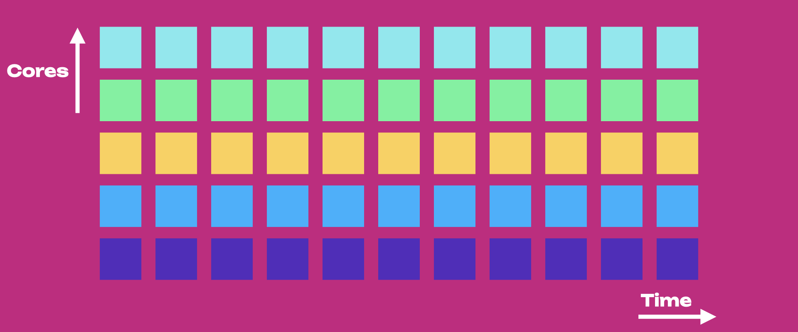
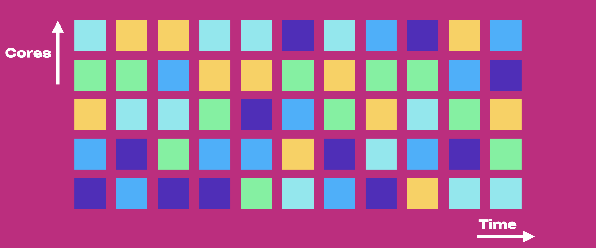
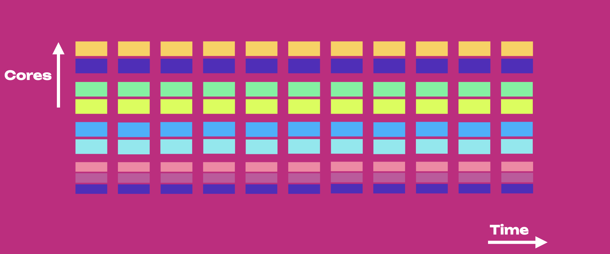
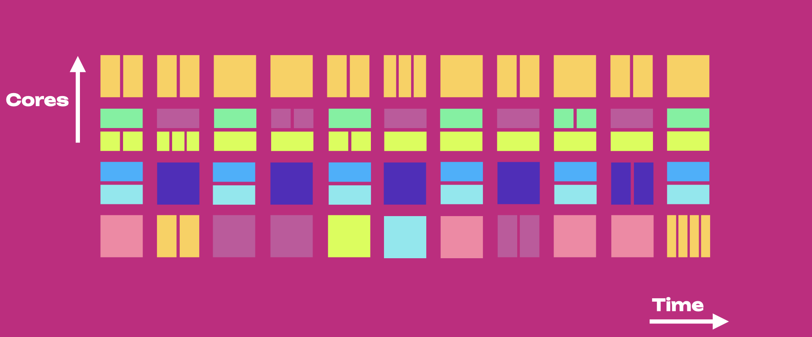

:::info

Material on this page is based on
[Gavin Wood's talk at Polkadot Decoded 2023](https://www.youtube.com/watch?v=GIB1WeVuJD0).

:::

Understanding what [Polkadot 1.0](./polkadot-v1.md) is about, and the philosophy behind it, will
help us to envision the future direction of the Polkadot ecosystem toward abstraction and
generalization.

## Polkadot as a Computational Resource

Polkadot has been abstracted and generalized beyond what it was originally proposed and envisioned
in the [whitepaper](https://polkadot.network/whitepaper/). Polkadot is:

- About [**Blockspace**](./polkadot-v1.md#polkadots-blockspace) (the underlying resources that
  chains need) not chains.
- **A platform to build applications** rather than chains, and for people to use those applications.
  Fundamentally, Polkadot is not a platform to host chains, and so far chains happened to be one way
  to build applications and grow Polkadot's utility.
- **A provider of resilient general-purpose continuation computation**, where the term
  _continuation_ refers to a broad long-running task that can do something, pause, and do some more
  (or something else) later on.
- **A multicore computer** where chains that continuously operate in parallel on different cores are
  called parachains. Currently, one core is reserved to one chain through
  [slot auction mechanism](../learn/learn-auction.md), although one core can be reserved on-demand
  to multiple chains at different time periods (see [parathreads](../learn/learn-parathreads.md)).
  At the time of writing (mid 2023) on Polkadot there are around 50 cores independently operating in
  parallel. Prediction models show that the number of cores can increase to 500-1000 in the
  following few years.

As a computational resource, Polkadot can be described as a traditional CPU, and a the time of
writing it has the following benchmarking features:

- Bandwidth: ~1MB/s
- Compute: Geekbench 5 SC score ~380
- Latency: 6s (time between two consecutive tasks)

These rating will likely increase over time.

## Contracts on Cores

If we follow this line of Polkadot being a global unbiquitous supercomputer, cores can be used to
run applications that can be deployed using:

- parachains and
- smart contracts, avoiding the need of custom chain infrastructure. This would be effective for
  contracts with constrained state and I/O (i.e. 2.5 MB), and heavy compute requirements. Such
  contracts will benefit from a secure and wide message passing environment as well.

From now _application_ will be used as a general term to describe anything that can use a Polkadot
core to access secure, decentralized and ubiquitous computation.

## From Slot Auctions to Coretime Marketplace

The final end product of blockchains is [**Blockspace**](./polkadot-v1.md#polkadots-blockspace).
Applications need to access Polkadot's blockspace, and the entry points to blockspace are the cores.
Thus, applications will need to reserve some time on cores or **Coretime** to gain the right to
access Polkadot's secure blockspace and interoperability for a definite time period.

Cores are agile and general: they can change what job they run as easily as a modern CPU. It follows
that the procurement of those cores must be agile as well. The current slot auction mechanism is not
agile, creates high entry barriers, and it is designed for long-running single applications (i.e.
the original Polkadot vision proposed in the whitepaper).

We depart from the classic lease auctions and propose an agile marketplace for Coretime where two
Polkadot-native sale options of Coretime are possible: **bulk** and **instantaneous**. This setup
maximizes the agility of Polkadot and lets the market figure out the best solution needed for the
applications do be successful.

### Bulk Coretime Rental

Bulk Coretime rental (primary market) is a monthly sale of 4 weeks Coretime at a fixed price with a
target of e.g. 75% of the available cores. The price will change depending on the deviation from the
target value, and unrented cores go to instantaneous market. Special considerations might be
necessary for pre-existing applications.

Bulk Coretime does not need to be directly deployed because it is an asset, more precisely a
non-fungible assets (unless it is for the same time period). Coretime tokens are sold in a 4-week
period and they can be split into multiple NFTs of smaller periods. Coretime NFTs are sold and
assigned by a broker system parachain to the applications now owning the NFTs, which must be
consumed to allocate computation on a Polkadot core. The broker parachain records the price and the
assignment, and the Coretime can always be purchased the following month for the same assignment
(i.e. same application) with a capped price change. This rent control allows long-running
applications to have certainty and predictability about Coretime costs (not possible with lease
auctions). The process of assigning Coretime is irreversible.

In general, bulk Coretime NFTs can be:

- sold to one application (similar to the lease auctions in Polkadot 1.0, with the difference that
  Coretime in Polkadot 1.0 is not sold but applications need to lock their DOT tokens)
- sold to a number of applications taking turns on a core
- placed on the instantaneous market
- exposed and sold by a broker system parachains via [XCM](./learn-xcm-index) NFT interface to
  Polkadot-powered applications that want to allow for these NFTs to be exchanged and traded on
  their market.

Bulk Coretime pricing will be initialized through Polkadot OpenGov and will likely start low to
minimize the entry barrier. Floor price, rent control and right-of-first-refusal will give long-term
guarantees on the price paid and core availability.

### Instantaneous Coretime Rental

Instantaneous Coretime rental is the ongoing sale of Coretime for immediate use at a spot price
where an AMM regulates the price targeting 100% usage. Bulk Coretime can be placed in this market.

Instantaneous Coretime is purchased by applications though collators to boost throughput and/or
reduce latency with extra cores, and power more exotic core contracts.

[Cumulus](../build/build-parachains.md#cumulus) will make sure that Coretime sales are adequately
utilized and optimized in an automatic fashion.

### Coretime Revenues

Revenues from Coretime sales can be burnt, used to fund the Treasury, split between Coretime
providers (i.e. validators), or used for a mix of those options. The topic is currently under
discussion. For more information see [RFC-0010](https://github.com/polkadot-fellows/RFCs/pull/10)
and [RFC-0015](https://github.com/polkadot-fellows/RFCs/pull/17/files).

## Core Usage in Polkadot 1.0

In Polkadot 1.0 applications where producing blocks at a fixed rate of 12 seconds whether it was
needed or not. This led to inefficient allocation of energy and economic incentives for producing
full blocks under heavy workload and empty blocks under light workload.

The figure below shows the core usage for Polkadot 1.0, where the horizontal axis is time and each
row represents a core. Different colors show five different parachains, each one using one core
(i.e. one parachain one core formula).

Core affinity (i.e. which application operates on which core) is not important (see below). Cores do
not have any grater friendliness to one application than another.

Ideally, blocks are produced when needed and the system targets full block capacity lowering the
probability to produce blocks half full or worse, empty.

We mentioned how the instantaneous Coretime rental targets 100% usage, and how bulk Coretime is sold
on a monthly basis maximizing agility and letting the market figuring out the best solution for
applications. The new vision of Polkadot will make the ecosystem even more agile and allow
applications to tweak how often they produce blocks based on their needs.

## Agile Coretime Allocation

### Split Coretime

Owners of Cortime can split or trade it. An application A1 can run on core C1 for a finite defined
period and then another application A2 can run on that core, or application A1 can continue running
on another core C2. Some applications might even stop running for some time and resume later on.

### Strided Coretime

Ranges can be strided (i.e. applications can take turns on a core) to share costs or decrease block
production rate for example.

### Combined Coretime

An application's task can be assigned to multiple cores at the same time. Some application can have
a permanent core assignment and an intermittent one, for example in period of high demand.

Coretime on additional cores can be bought on the instantaneous market and send multiple blocks to
multiple cores at the same time slot to reduce latency.

## Agile Core Usage

### Compressed Cores

The same core can secure multiple blocks of the same application at the same time. Combining
multiple application blocks in the same relay chain core will reduce latency at the expense of
increased bandwidth for the fixed price of opening and closing a block.

### Shared Cores

Sharing cores with other applications to share costs but with no reduction in latency. Note that
this is different from the [split coretime](#split-coretime) where one core is used by multiple
application at different times to share costs at the expense of higher latency.

## Agile Ubiquitous Computer

All the above options of agile [Coretime allocation](#agile-coretime-allocation) and
[core usage](#agile-core-usage) can be composable and enable the creation of an extremely agile
ubiquitous computing system.

Thus, this new vision is focused on the resource that Polkadot provides, which is secure, flexible
and available blockspace that can be accessed by reserving some time on a core. Agility in
allocation of Coretime and use of cores allow to maximize network efficiency.

## From Chain- to Application-centricity

Polkadot 1.0 was a chain-centric paradigm consisting in isolated chains able to exchange messages.
This was not fundamentally different form having completely different chains connected to bridges,
with the only difference of having the relay-chain securing the network, providing message-passing
capability, and doing some extra tasks such as [crowdloans](../learn/learn-crowdloans.md),
[auctions](../learn/learn-auction.md), [staking](../learn/learn-staking.md),
[accounts](./learn-accounts-index), [balances](../learn/learn-balance-transfers.md), and
[governance](../learn/learn-polkadot-opengov.md). Having a chain-centric system will ultimately end
on chain-centric application and UX.

The true value of Polkadot is about leveraging the unique value proposition offered by different
chains, and use the collaborative potential of those chains to build inter-chain applications to
solve real-world problems. Those applications will thus need to span across chains, and have a
seamless UX so that users are not aware and do not need to understand how actions are performed by a
mosaic of cross-chain transactions.

Increasingly fewer tasks will be handled by the relay-chain, which will focus efforts only on
securing the network and providing secure message-passing capability. System parachains will be used
for tasks such as staking, governance, etc.

### Agile Polkadot Representation

Polkadot 1.0 was represented with the relay-chain surrounded by parachains. Following the new
application-centric vision, Polkadot can be better represented
